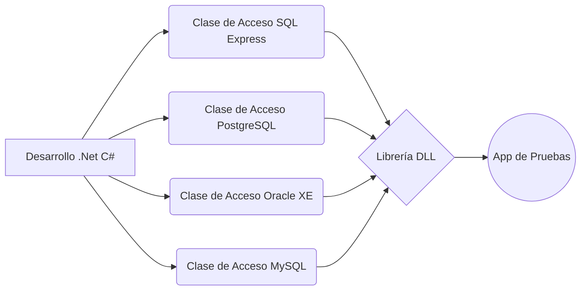

# Acceso a Bases de Datos usando .Net

Este proyecto tiene la finalidad de exponer el accesos a las **Bases de Datos** más importantes usando la **Tecnología .Net**

Las **Bases de Datos** con las que se trabaja son las siguientes:

> 1. SQL Server Express 2014
> 2. PostgreSQL 9.5
> 3. MySQL Community 5.7.23
> 4. Oracle XE 11g

## Descargas

En esta sección se exponen las versiones de **Bases de Datos** con las que se trabajan en este proyecto y la dirección web para su descarga.

> 1. [SQL Server Express 2014](https://download.microsoft.com/download/E/7/F/E7F2DCDF-BB7A-4929-BCA6-90B25D504E4F/SQLEXPR_x64_ESN.exe)
> 2. [PostgreSQL 9.5](https://get.enterprisedb.com/postgresql/postgresql-9.5.14-2-windows-x64.exe)
> 3. [MySQL 5.7.23](https://dev.mysql.com/get/Downloads/MySQLInstaller/mysql-installer-community-5.7.23.0.msi)
> 4. [Oracle XE 11g](http://download.oracle.com/otn/nt/oracle11g/xe/OracleXE112_Win64.zip)

## Diagrama

A continuación se detalla el diagrama de operación para este proyecto:

Ver [Mermaid](https://mermaidjs.github.io/).
